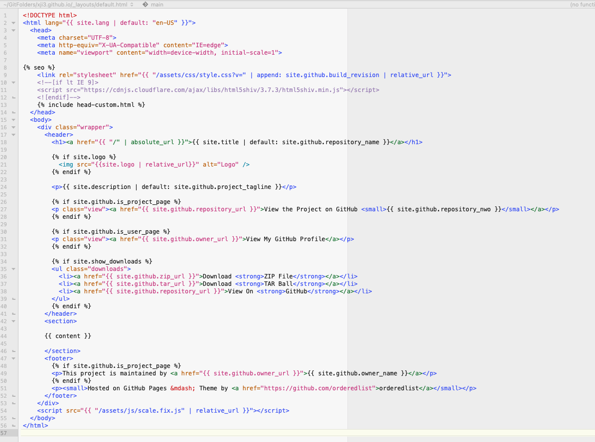

### Tutorial: How this site was built

#### Create your github.io repository

You get one site per GitHub account and organization ([reference](https://pages.github.com/)).

We will simply create a new public repository named "_username.github.io_", where _username_ is your username (or organization name) on GitHub.  Note, the url for your GitHub page is thus <https://username.github.io/> (Dr. Google can tell you how to link it to a different url). 


#### First look of your git repo

Your new repository now looks similar to the image below


#### Choose a Jekyll theme for your site

Without knowing what everything is, let's just pick a Jekyll theme for our site.
My personal favorite (right now) is the [Minimal theme](https://pages-themes.github.io/minimal/).
We will use this theme in this tutorial, but feel free to pick one for yourself (e.g. take a look at <http://jekyllthemes.org/>).


#### Find the wheel

Let's move to the [project repository of Minimal theme](https://github.com/pages-themes/minimal) on GitHub.
We want to build our webpage by modifying these files.


Now, we want to get a local copy of these files.

You could do it either by


1. type in the terminal
```
cd where_to_store_this_repo
git clone https://github.com/pages-themes/minimal.git
```  
2. Download a ZIP file from "Code" -> "Download ZIP"

We will now git clone both repositories and copy paste all files from minimal to our repo.
This seems the easiest way of doing it, but there might be better ways (e.g. [stack overflow answer](https://stackoverflow.com/questions/17371150/moving-git-repository-content-to-another-repository-preserving-history)).

I run these commands in terminal (the last line is to copy non-hidden files only: [reference](https://stackoverflow.com/questions/11557114/cp-r-without-hidden-files)):

```
git clone https://github.com/xji3/xji3.github.io.git
git clone https://github.com/pages-themes/minimal.git
cd xji3.github.io
rsync -av --exclude=".*" ../minimal/ ./
``` 


Let's follow [these instructions](https://github.com/pages-themes/minimal#previewing-the-theme-locally) to build the static site locally with Jekyll first.

```
bundle exec jekyll serve
```

I ran into an error mesage:


After some googling, it seems fixed by following the solution in this [jekyll issue report](https://github.com/jekyll/jekyll/issues/8523) and adding a line into the _Gemfile_
```
gem "webrick"
```


Now you should be able to build and host the site locally.
Your terminal might look like this


And you can open the site from the server address <http://127.0.0.1:4000/> in your browser


Now, we will push these changes from our local copy onto GitHub's server.
We can do it by  
1. using command line (recommended)  
2. GitHub web page UI

```
git status
git add .
git commit -m 'copy over minimal theme files'
git push
```

Wait for GitHub to build the site and then see the change (<https://xji3.github.io/>)

#### Modify the wheel, not reinvent it

Now, let's look at what and where each element in the webpage is so that we can turn it into our personal webpage!


##### \_config.yml file

At the minimum survival level, the "[_config.yml](../_config.yml)" specifies ["Configuration"](https://jekyllrb.com/docs/configuration/) for your site.


##### \_layouts folder

Next, let's take a look at the html files in the [_layouts](../_layouts) folder.
The html files define templates that can be used by any page in your site and wrap around page content.
For a more detailed description, please visit [this page](https://jekyllrb.com/docs/step-by-step/04-layouts/).

Let's open the default.html file with a text editor.
Locate the line that contains "site.title" (line 18)



Looks familiar?  We saw it in the "_config.yml" file!
Basically, this chunk means getting the value stored in the variable "site.title" which is defined in the "\_config.yml" file.

For more details, you want to learn about [Liquid](https://jekyllrb.com/docs/liquid/).
If you know nothing about HTML format, this minimal amount of introduction might help [HTML intro](https://tulane-math-7360-2021.github.io/lectures/13-scraping/scraping.html#html-introduction) and of course, Google is your best friend.

Now, let's change the "site.title" value by changing the "\_config.yml" file.
And we want to point the "logo" to a different picture.
The modified "\_config.yml" file looks


Let's take a quick look at the changes to the site (locally)


I also want to change the tiny single line at the lower left corner.
We could do this by modifying the "default.html" file.


##### \_includes folder

We won't talk about the "\_includes" folder although it has important functionalities.  You might want to read [this page](https://jekyllrb.com/docs/includes/) if interested.

Include is related to the statement containing "include", e.g. `{ % include footer.html % }` will let Jekyll look for the referenced "footer.html" file in the \_includes folder at the root of the source directory and insert its content.

To make things simple, we can comment out the `{ % include head-custom-google-analytics.html % }` at line 4 in "\_includes/head-custom.html" file.

##### Directory structure

As usual, we ignore many details (available [here](https://jekyllrb.com/docs/structure/)).
But just note that Jekyll looks for "index.html" or "index.md" file to render for each webpage.

Now, let's modify the "index.md" file in the root directory (which originally contains a Markdown cheat sheet).  If you want to keep the cheat sheet for reference, you can simply rename the file to a different name and create a new "index.md" file.

I just copy existing content from my personal webpage here.  The modified "index.md" file looks


Let's see how the site changes locally again.


##### Navigation bar

It looks lame to have a personal website with a single page.
Let's add in a Navigation bar with multiple pages.

We do this by, again, modifying the "default.html" file from the "_layouts" folder which controls the page layout of our site.
We now add a section inside the "\<header\>" section.


And the site now looks


##### Fill/edit side bar links

You can see that the navigation link "CV" points to folder "/CV".
And similarly, Jekyll looks for an "index" file inside folder "/CV" to render the page.

We can simply create a folder named "CV" with an "index.md" file inside.
As lazy as I am, of course I just copied over my CV from existing site.
I copied over "/Publication", "/teaching" folders.  Note that the "Publicaiton" folder actually contains content for the "Research" tab.

I feel happy with these modifications.  I want to push the changes onto GitHub.

```
git status
git add .
git commit -m 'add in personal webpage content into Minimum default files'
git push
```
You need to wait a few minutes for GitHub to build your site.  Be patient and remember, it is free.

After the site is built, you might notice a little difference


If you don't like the "View My GitHub Profile" part, you should be able to remove it by editing the "default.html" page by yourself.

##### Embed pdf file into webpage

You can embed pdf file into the webpage by using [PDFObject javascript](https://github.com/pipwerks/PDFObject).  You can find an example of it in how I wrote my "CV" and "Research" pages.

#### font color

I want to customize the font colors to have wave green instead of blues ([source](https://mmistakes.github.io/minimal-mistakes/docs/stylesheets/)).  This might be out of the scope of this course, but you could read about [_sass](https://jekyllrb.com/docs/assets/).

With some guess-and-trial, I found that the link colors are defined in "\_sass/jekyll-theme-minimal.scss".
I simply changed the color for "h1" and "a" tags.


#### Markdown cheat sheet

Of course I kept a cheat sheet locally [here](./cheat_sheet.md)